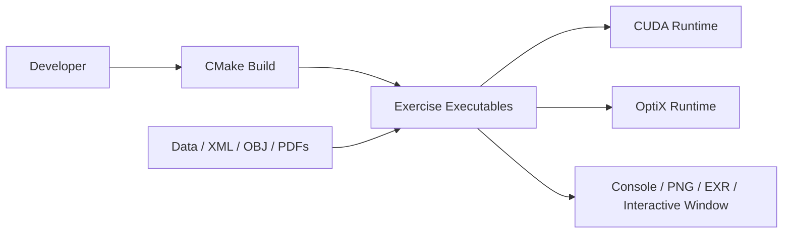
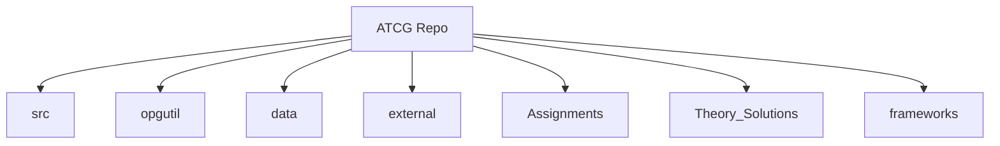
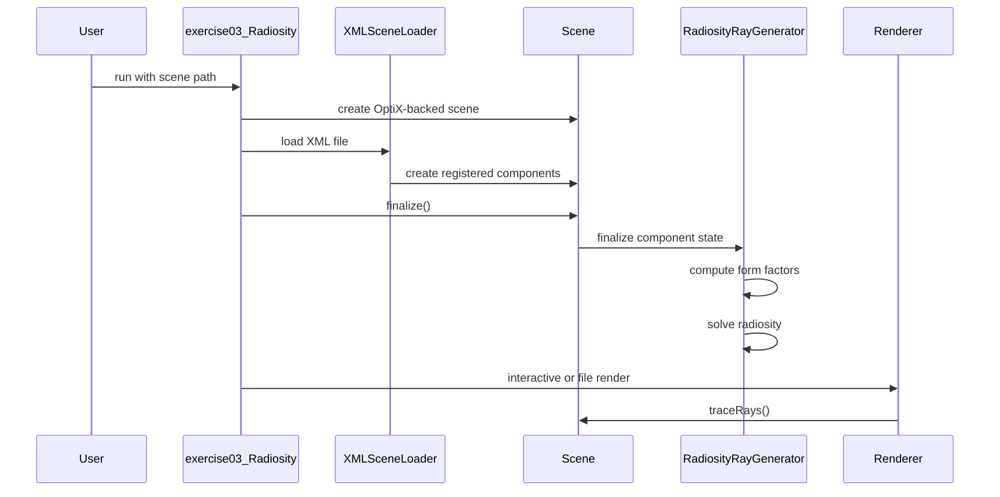

# ATCG CUDA/OptiX Playground

Developer-facing documentation for the Advanced Topics in Computer Graphics I coursework repository. This repository combines assignment materials, theory submissions, exercise implementations, and a reusable CUDA/OptiX rendering framework.

Current implemented exercise targets:
- `exercise00_CUDAIntro`
- `exercise01_HDR`
- `exercise03_Radiosity`
- `exercise04_WhittedRaytracing`
- `exercise05_BRDFModels`

## Table of Contents
- [1. Introduction and Goals](#1-introduction-and-goals)
- [2. Architecture Constraints](#2-architecture-constraints)
- [3. Context and Scope](#3-context-and-scope)
- [4. Solution Strategy](#4-solution-strategy)
- [5. Building Block View](#5-building-block-view)
- [6. Runtime View](#6-runtime-view)
- [7. Deployment View](#7-deployment-view)
- [8. Crosscutting Concepts](#8-crosscutting-concepts)
- [9. Architectural Decisions](#9-architectural-decisions)
- [10. Quality Requirements](#10-quality-requirements)
- [11. Risks and Technical Debt](#11-risks-and-technical-debt)
- [12. Glossary](#12-glossary)

## 1. Introduction and Goals
This repository is an ATCG course codebase built around CUDA, OptiX, and a lightweight reusable rendering framework in `opgutil`. It serves two roles at the same time:
- a place to implement and run course exercises
- a small rendering playground for experimenting with GPU kernels, image processing, scene loading, and ray tracing

The main goals are:
- provide isolated executables for each exercise
- reuse common infrastructure for memory management, OptiX setup, scene loading, and rendering
- keep assignment PDFs, framework snapshots, data sets, and theory write-ups in one place

### Build and Run
The repository is configured with CMake and produces one executable per exercise directory under `src/`.

```bash
cmake -S . -B build
cmake --build build
```

Typical run commands:

```bash
./bin/exercise00_CUDAIntro
./bin/exercise01_HDR -d data/exercise01_HDR/book
./bin/exercise01_HDR -d data/exercise01_HDR/book -m all
./bin/exercise03_Radiosity -s data/exercise03_Radiosity/simple0.xml
./bin/exercise03_Radiosity -s data/exercise03_Radiosity/cornell_box.xml
./bin/exercise04_WhittedRaytracing -s data/exercise04_WhittedRaytracing/cornell_box_spheres.xml
./bin/exercise04_WhittedRaytracing -s data/exercise04_WhittedRaytracing/cornell_box_cubes.xml
./bin/exercise05_BRDFModels -s data/exercise05_BRDFModels/brdf_models.xml
```

Notes:
- the project configures runtime outputs to land in `bin/`
- actual executable paths can still vary slightly by generator or IDE
- interactive rendering starts when `exercise03_Radiosity`, `exercise04_WhittedRaytracing`, or `exercise05_BRDFModels` is run without an output flag

## 2. Architecture Constraints
The current repository imposes these hard constraints:
- build system: CMake 3.18+
- languages: C++, CUDA, and C
- standards: `CMAKE_CXX_STANDARD 17` and `CMAKE_CUDA_STANDARD 17`
- GPU toolchain: CUDA Toolkit 11.0 or newer
- ray tracing API: NVIDIA OptiX, expected under `external/OptiX`
- rendering model: GPU-first execution with CUDA kernels and OptiX pipelines
- third-party dependencies: vendored in `external/`
- GUI stack: GLFW, OpenGL, and ImGui for interactive rendering

Platform/build nuances:
- the CMake setup contains MSVC-specific flags and path handling
- PTX generation is integrated into the build through custom CMake helpers
- some `.cu` files are compiled to PTX for OptiX, while others are compiled as regular object files for direct kernel launches

## 3. Context and Scope
The repository boundary includes exercise executables, shared framework code, local datasets, bundled frameworks, and theory write-ups.

Inputs:
- XML scene files
- OBJ meshes
- PNG image sequences and EXR HDR references
- assignment PDFs
- theory solution sources

Outputs:
- console output for CUDA exercises
- PNG and EXR files for image processing tasks
- interactive windows for scene rendering
- offline rendered images

External systems:
- local developer workstation
- CUDA runtime and NVIDIA GPU driver
- OptiX runtime
- filesystem assets and generated outputs



## 4. Solution Strategy
The repository uses a shared-framework-plus-exercises approach:
- `opgutil` contains the reusable runtime, memory helpers, scene system, GUI wrappers, and OptiX integration
- each subdirectory under `src/` defines one executable target
- CMake auto-discovers exercise directories via `src/*/CMakeLists.txt`
- rendering exercises describe scenes in XML and instantiate components through a factory registry
- CUDA code is split between:
  - direct kernels linked into executables
  - PTX modules loaded into OptiX pipelines

This strategy fits the repo because it keeps coursework tasks separate while avoiding duplication in:
- device-buffer management
- scene parsing
- OptiX pipeline setup
- interactive and offline rendering frontends

## 5. Building Block View

### 5.1 Level 1 Whitebox
Top-level repository building blocks:
- `src/`: exercise executables
- `opgutil/`: shared framework and runtime code
- `data/`: input assets for exercises
- `external/`: vendored third-party libraries
- `Assignments/`: assignment PDFs
- `Theory_Solutions/`: written solutions
- `frameworks/`: archived and unpacked framework snapshots provided during the course
- `lib/`: tracked library/PTX outputs currently present in the repo



### 5.2 Level 2 Whitebox
Main functional subsystems:

`src/exercise00_CUDAIntro`
- standalone CUDA tasks
- direct device-buffer usage
- kernels compiled as object code and called from host code

`src/exercise01_HDR`
- Robertson HDR reconstruction
- tone mapping algorithms
- image sequence input from `data/exercise01_HDR/book`

`src/exercise03_Radiosity`
- scene-driven radiosity rendering
- XML scene loading
- OptiX-based visibility queries
- interactive and file-based rendering

`src/exercise04_WhittedRaytracing`
- recursive Whitted-style ray tracing pipeline
- opaque (diffuse + ideal specular) and refractive BSDFs
- point and directional light sources
- Cornell box scenes with spheres and cubes (`data/exercise04_WhittedRaytracing/*.xml`)

`src/exercise05_BRDFModels`
- extends the Whitted framework with glossy BRDF models
- energy-conserving Phong / Cosine-Lobe BRDF
- anisotropic Geisler-Moroder Ward BRDF (Beckmann NDF, Schlick Fresnel)
- anisotropic GGX / Trowbridge-Reitz Cook-Torrance BRDF (Smith G, Schlick F)
- reference scene `data/exercise05_BRDFModels/brdf_models.xml`

`opgutil/opg/scene`
- `Scene` orchestration
- XML scene loader
- component registration/factory system
- shape instances and component lifecycle

`opgutil/opg/gui`
- interactive renderer
- file renderer
- camera controls and simple GUI/display integration

`opgutil/opg/memory` and `opgutil/opg/raytracing`
- device-buffer abstractions
- output-buffer abstractions
- OptiX pipeline and SBT support

### 5.3 Level 3 Whitebox
Selected internal building blocks worth understanding first:

XML scene loading:
- `XMLSceneLoader` parses `<component>` and `<property>` nodes
- component factories are registered via `OPG_REGISTER_SCENE_COMPONENT_FACTORY`
- XML `reference` properties resolve by component name inside `Scene`

Scene finalization:
- shapes prepare acceleration structures
- `Scene::buildIAS()` builds the top-level instance acceleration structure
- components initialize OptiX pipeline/SBT entries
- the pipeline and SBT are finalized
- each component gets a finalization callback

Radiosity internals:
- `RadiosityEmitter` wraps emission, albedo, and per-primitive radiosity buffers
- `RadiosityRayGenerator` computes form factors, solves radiosity, and renders from the scene camera

Whitted ray tracing internals:
- `WhittedRayGenerator` drives recursive primary, shadow, reflection, and refraction rays
- BSDFs implement `evalBSDF` and `sampleBSDF` callable shaders bound through the SBT
- light sources expose direct sampling for shadow rays in `lightsources.cu`

BRDF models internals (`src/exercise05_BRDFModels/bsdfmodels.cu`):
- `__direct_callable__phong_evalBSDF`: `F0 * (n+2)/(2π) * max(0, R·V)^n`
- `__direct_callable__ward_evalBSDF`: anisotropic Geisler-Moroder Ward, unnormalised halfway `H = L + V`
- `__direct_callable__ggx_evalBSDF`: anisotropic GGX NDF with separable Smith Λ and the `α²tan²θ` form from the assignment sheet
- all three flip the normal toward the viewer, re-orthonormalise the tangent, and compute the bitangent as `cross(N, T)`

### 5.4 Repository Structure
Practical directory summary:

```text
.
├── Assignments/
├── CMake/
├── Theory_Solutions/
├── data/
│   ├── exercise00_CUDAIntro/
│   ├── exercise01_HDR/
│   ├── exercise03_Radiosity/
│   ├── exercise04_WhittedRaytracing/
│   └── exercise05_BRDFModels/
├── external/
├── frameworks/
│   ├── ZIP/                       # framework_base, r00, r01, r03, r04, r05
│   ├── framework_r00/
│   └── framework_r01/
├── opgutil/
│   └── opg/
│       ├── gui/
│       ├── hostdevice/
│       ├── memory/
│       ├── raytracing/
│       └── scene/
└── src/
    ├── exercise00_CUDAIntro/
    ├── exercise01_HDR/
    ├── exercise03_Radiosity/
    ├── exercise04_WhittedRaytracing/
    └── exercise05_BRDFModels/
```

Theory write-ups are organised by sheet under `Theory_Solutions/r01`, `r03`, `r04`, `r05`, each containing the LaTeX sources and the compiled solution PDF.

## 6. Runtime View

### 6.1 CUDA Intro Execution
`exercise00_CUDAIntro` runs a set of task functions from `main.cpp`:
- host code prepares inputs
- `DeviceBuffer` uploads or allocates GPU memory
- direct CUDA kernels execute
- results are downloaded or written to disk

Representative tasks:
- integer sequence generation and scaling
- Sobel filtering
- random-number generation and parallel counting
- matrix multiplication

### 6.2 HDR Reconstruction and Tone Mapping
`exercise01_HDR` supports two runtime modes:
- HDR reconstruction from exposure-bracketed LDR images
- tone mapping of an EXR image

Flow:
- parse CLI arguments
- read `images.txt` and referenced PNG exposures
- reconstruct HDR radiance and CRF with Robertson
- optionally tonemap an HDR image into PNG outputs

### 6.3 Radiosity Scene Rendering
`exercise03_Radiosity` is scene-driven:
- create OptiX context
- load XML scene
- instantiate camera, shapes, emitters, and ray generator
- finalize the scene and build acceleration structures
- compute form factors and radiosity solution
- either:
  - start an interactive renderer
  - or render one image to disk



### 6.4 Whitted Ray Tracing
`exercise04_WhittedRaytracing` reuses the scene/loader pipeline of the radiosity exercise but swaps in:
- `raygen.whitted` as the entry program
- `bsdf.opaque` and `bsdf.refractive` materials
- point and directional emitters

Flow per pixel: shoot a primary ray, evaluate direct lighting against each light, recurse into reflection/refraction branches when the BSDF declares an ideal-reflection or ideal-transmission component, and terminate at a configurable depth.

### 6.5 BRDF Models
`exercise05_BRDFModels` extends the Whitted pipeline with three glossy BRDF families behind new component types:
- `bsdf.phong`
- `bsdf.ward` (isotropic via `roughness`, anisotropic via `roughness_tangent` / `roughness_bitangent`)
- `bsdf.ggx` (same isotropic/anisotropic parameterisation)

The reference scene `data/exercise05_BRDFModels/brdf_models.xml` lines up five spheres lit by white-from-above plus R/G/B side lights, matching Figure 1 of the assignment sheet (Phong, isotropic Ward, anisotropic Ward, isotropic GGX, anisotropic GGX, left to right).

### 6.6 Example Scene Composition
The radiosity scenes in `data/exercise03_Radiosity/*.xml` follow a consistent pattern:
- define a `camera`
- define a `raygen.radiosity`
- define mesh shapes such as `shape.objmesh`
- attach `emitter.radiosity` components to `shapeinstance` nodes

The Whitted and BRDF scenes follow the same XML conventions but use `raygen.whitted`, `bsdf.*`, and `emitter.point` / `emitter.directional` instead. The simple scenes are good for sanity checks; the Cornell box scenes and the BRDF reference scene are closer to the intended final use case.

## 7. Deployment View
The effective deployment target is a local developer workstation with an NVIDIA GPU.

Runtime/build layout:
- source tree at the repo root
- runtime executables expected in `bin/`
- compiled libraries and PTX artifacts under `lib/`
- scene and image assets loaded from `data/`

Required local environment:
- CMake
- CUDA Toolkit
- OptiX-compatible GPU and driver
- OptiX SDK/runtime matching the expected headers/libraries

There is no server-side or cloud deployment model in the current repository.

## 8. Crosscutting Concepts

### CMake Target-per-Exercise Pattern
Each exercise directory contains its own `CMakeLists.txt`, and `src/CMakeLists.txt` auto-discovers them. This keeps the addition of new exercises low-friction.

### PTX vs OBJ CUDA Compilation
The build distinguishes between:
- `.cu` files compiled into PTX for OptiX shader loading
- `.cu` files compiled into object code for direct kernel invocation

This split is handled through custom CMake helpers and source annotations.

### Root and PTX Path Resolution
The helper functions in `opgutil/opg/opg.h` provide:
- `getRootPath()`
- `getPtxFilename(...)`

These allow executables to locate assets and PTX files independent of the working directory.

### Scene Description by XML
Rendering exercises use declarative XML scene files. Components are instantiated from `type` strings such as:
- `camera`
- `shapeinstance`
- `shape.objmesh`
- `raygen.radiosity`
- `emitter.radiosity`

### Component Registration
Scene components register factories statically using macros in `opgutil/opg/scene/sceneloader.h`. The XML loader looks up the factory by name and creates the matching object.

### Memory Abstractions
`DeviceBuffer` and related helpers encapsulate:
- allocation
- upload/download
- typed buffer views for host/device use

This keeps exercise code shorter and more consistent than raw CUDA API usage everywhere.

### Rendering Modes
The rendering stack supports:
- interactive windowed rendering through `InteractiveSceneRenderer`
- offline image generation through `FileSceneRenderer`

### Error Handling
The codebase uses assertion/check helpers such as:
- `OPG_CHECK`
- `CUDA_SYNC_CHECK`
- `OPTIX_CHECK`

The common pattern is fail-fast behavior during development rather than silent recovery.

## 9. Architectural Decisions
- Bundle third-party dependencies inside `external/` to reduce setup variance across student machines.
- Centralize reusable rendering/runtime logic in `opgutil` instead of duplicating infrastructure in each exercise.
- Use one CMake target per exercise directory so coursework tasks remain isolated.
- Use XML scene descriptions for rendering tasks to separate scene authoring from renderer implementation.
- Keep assignment PDFs, theory submissions, and framework snapshots in the same repository for course traceability.
- Use OptiX for scene-based ray tracing tasks while keeping direct CUDA kernels available for non-ray-tracing exercises.

## 10. Quality Requirements
Important quality goals for this repository are:
- build reproducibility across local setups
- clear separation between exercises and shared infrastructure
- easy extension with additional exercises or scene components
- correctness of GPU-heavy numerical and rendering workflows
- discoverability of data, scenes, and theory artifacts

There is no formal benchmark or automated validation suite in the current tree, so quality is mainly enforced through structure, manual runs, and exercise-level inspection.

## 11. Risks and Technical Debt
- No automated tests were found in the current repository.
- `cmake` and `nvcc` were not available in the inspected environment, so build instructions are documented from source configuration rather than verified locally here.
- Tracked build artifacts already exist under `lib/`, which blurs the line between source and generated outputs.
- Tracked PTX files exist for `exercise02_Raycasting` under `lib/ptx/`, but there is no matching `src/exercise02_Raycasting` directory in the current tree.
- The repository has a large vendored dependency surface in `external/`, which simplifies checkout setup but increases maintenance overhead.
- The build is toolchain- and GPU-dependent, especially for OptiX-based exercises.

## 12. Glossary
- `OptiX`: NVIDIA’s ray tracing framework used here for scene traversal and shader-style GPU programs.
- `PTX`: NVIDIA’s intermediate GPU code representation used for OptiX program modules.
- `IAS`: Instance Acceleration Structure, the top-level OptiX acceleration structure over scene instances.
- `GAS`: Geometry Acceleration Structure, the lower-level acceleration structure built for geometry.
- `Ray Generator`: the OptiX entry program that launches rays and orchestrates rendering or computation.
- `Shape Instance`: a scene component that places a shape in the world with a transform and attached material/emitter context.
- `HDR`: High Dynamic Range image or radiance representation.
- `LDR`: Low Dynamic Range image, typically PNG/JPEG-style 8-bit image data.
- `CRF`: Camera Response Function used in HDR reconstruction.
- `Radiosity`: a global illumination method solving diffuse energy exchange between patches.
- `Form Factor`: the geometric transport term describing how much energy travels from one patch to another.
- `Scene Component`: a registered runtime object created from XML and inserted into `Scene`.
